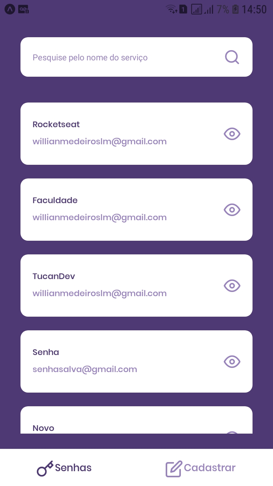
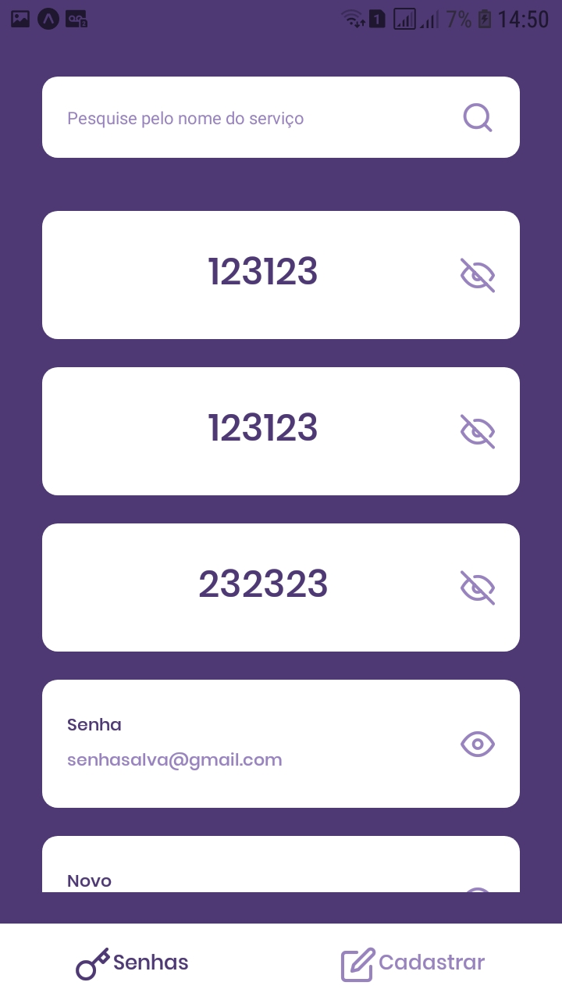
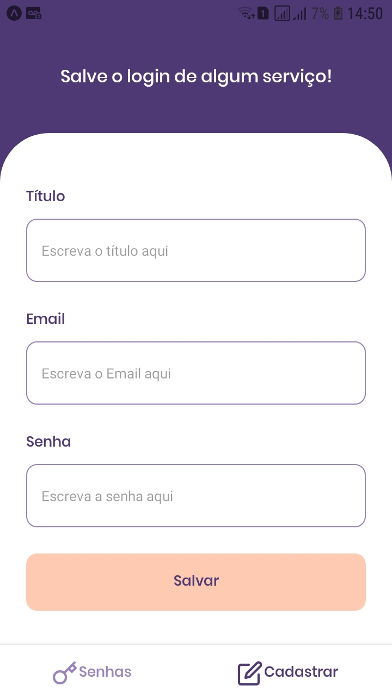

<h1 align="center">
  < PassManager /><br>
</h1>

<br>

<h1 align="center">
  
  
  
</h1>

## 💻 Projeto

O PassManager, é um app para salvar em apenas um lugar os seus logins. Esta foi a aplicação proposta para o desafio, após o termino do segundo módulo do Ignite (Curso realizado pela [Rocketseat](https://rocketseat.com.br/)) na trilha de React Native.<br>
Este app teve como objetivo colocar os conhecimentos adquiridos no segundo módulo, como: Salvamento no AsyncStorage, Themas globais com styled-components e Contexto global com hook.<br>
O app salva os dados no AsyncStorage.

## 💬 Funcionalidades
- Adcionar dados da senha, contendo: Título, email, senha;
- Pesquisar senha pelo título;
- Mostrar e ocultar a senha;

## 🎲 Executar aplicação
```bash
# Clone este repositório
$ git clone https://github.com/WillianMedeiros14/PassManager.git

# Entre na pasta do projeto.
$ cd PassManager

# Instale as dependências
$ yarn

# Execute a aplicação (Android)
$ yarn android

```

## 🚀 Tecnologias ultilizadas

- Este app foi criado com Bare Workflow, o qual possibilita criar aplicações **[React Native](https://reactnative.dev/)**, utilizando tanto as funcionalidades nativas do React Native como também as do **[Expo](https://docs.expo.io)**

